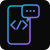
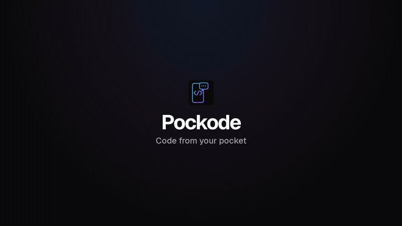
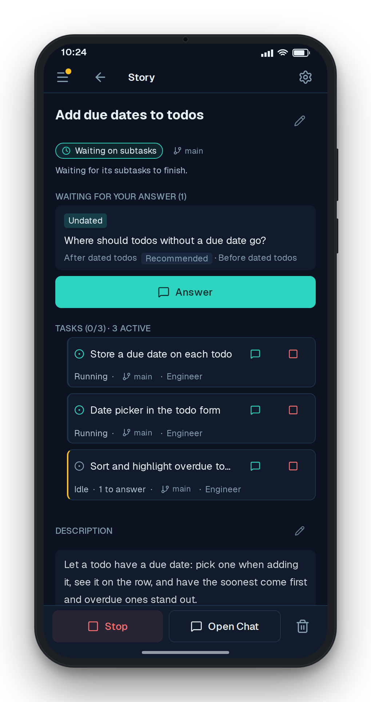
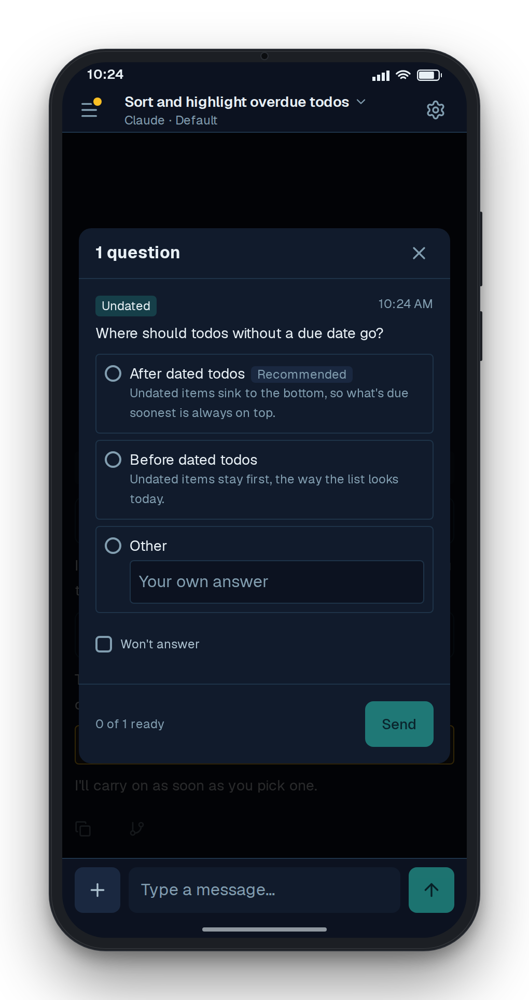
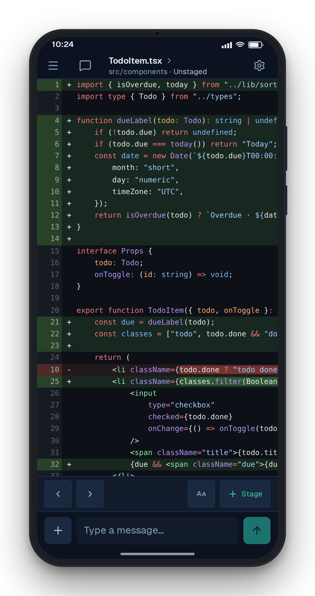
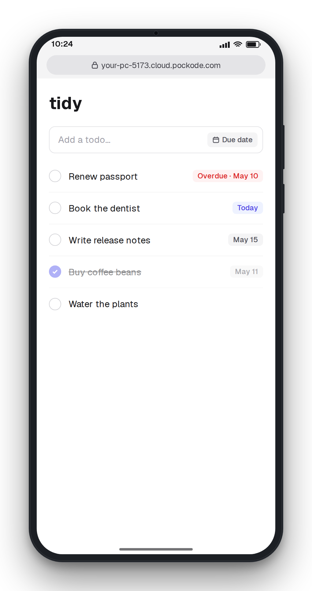
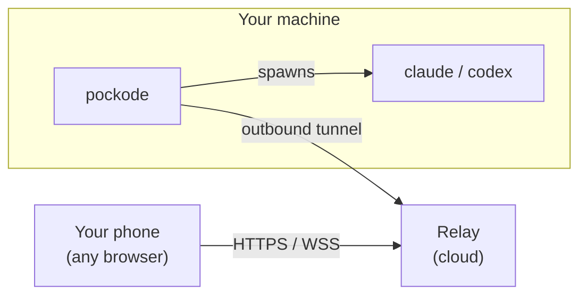

<div align="center">



# Pockode

<!-- messaging:tagline -->
**Your coding agents keep working. Steer them from your phone.**

Hand stories to a team of Claude Code and Codex agents on your own machine, answer their questions and ship the result from any browser.
<!-- /messaging:tagline -->

[](https://github.com/sijiaoh/pockode/actions/workflows/server.yml)
[](https://github.com/sijiaoh/pockode/actions/workflows/frontend.yml)
[](https://github.com/sijiaoh/pockode/releases)

[Website](https://pockode.com) · [Docs](https://pockode.com/docs/) · [Changelog](https://pockode.com/changelog/)



</div>

## Quick Start

<!-- messaging:quickstart -->
Pockode drives the `claude` or `codex` CLI, so install one of them on the same machine first.

**macOS / Linux**

```sh
# Install
curl -fsSL https://pockode.com/install.sh | sh

# Run (on your dev machine, in your project directory)
pockode -password YOUR_PASSWORD
```

**Windows**

```powershell
# Install
irm https://pockode.com/install.ps1 | iex

# Run (on your dev machine, in your project directory)
pockode -password YOUR_PASSWORD
```

Scan the QR code with your phone.
<!-- /messaging:quickstart -->

<!-- messaging:platforms -->
Runs on macOS (Intel and Apple silicon), Linux (amd64 and arm64) and Windows (x64, also on Windows 11 on Arm).
<!-- /messaging:platforms -->
Install options, verifying the download and upgrading: [platform support](docs/platforms.md). Several projects on one machine: [cluster mode](docs/cluster.md). Pre-1.0 and released often: read the [release notes](https://github.com/sijiaoh/pockode/releases) before upgrading.

## Features

<!-- messaging:pillars -->
- **Delegate** — Split a story into tasks, each run by a Claude Code or Codex agent in its own role.
- **Stay in the loop** — When an agent needs a decision, it stops and asks; you answer from anywhere.
- **Review & ship** — Read the diff, commit, and open your dev server on your phone with Port Preview.
- **Your machine** — Pockode dials out from beside your project, so there is no port to forward.
<!-- /messaging:pillars -->

<table>
  <tr>
    <td></td>
    <td></td>
  </tr>
  <tr>
    <td></td>
    <td></td>
  </tr>
</table>

## How it works



Pockode runs beside your project and drives the AI CLI there. [How it is secured](https://pockode.com/security/).

## Contributing · Security · License

- **Contributing** — Issues, [discussions](https://github.com/sijiaoh/pockode/discussions) and documentation PRs are welcome; see [CONTRIBUTING.md](CONTRIBUTING.md).
- **Security** — Report vulnerabilities privately; see [SECURITY.md](SECURITY.md).
  <!-- messaging:license -->
- **License** — Source available under the [O'Saasy License](LICENSE.md). You may use, modify and redistribute it, but not offer it to others as a competing hosted service.
  <!-- /messaging:license -->
