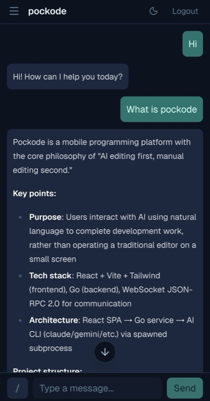
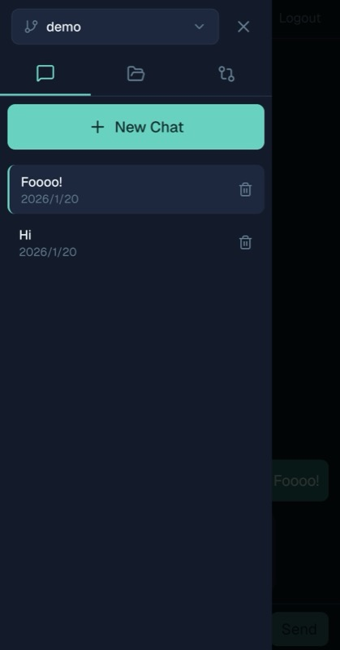
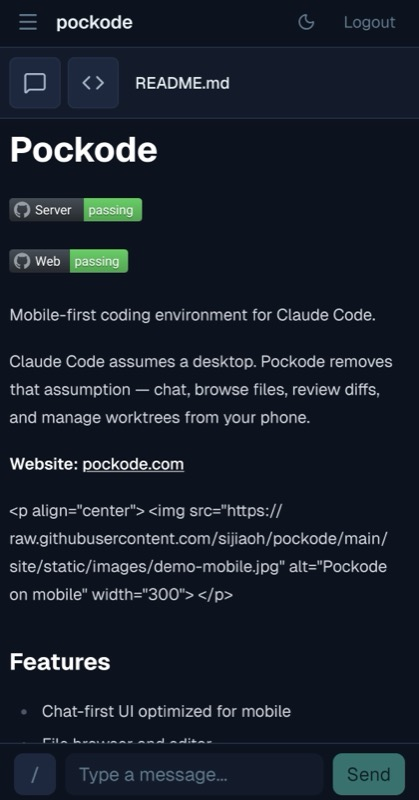
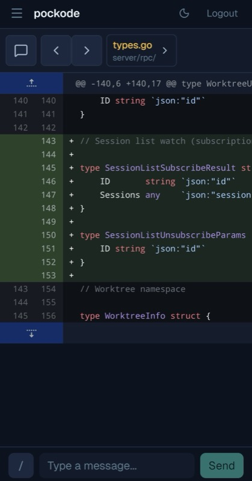

# Pockode

[](https://github.com/sijiaoh/pockode/actions/workflows/server.yml)
[](https://github.com/sijiaoh/pockode/actions/workflows/frontend.yml)

**Your dev machine in your pocket.**

Pockode connects your phone to your home dev machine running Claude Code or Codex. Chat with AI, browse files, review diffs, and manage worktrees — from anywhere.

| Chat | Sessions | File | Diff |
|:----:|:--------:|:----:|:----:|
|  |  |  |  |

## Why Pockode?

Your powerful dev machine sits at home. With Pockode, you can use it from anywhere.

- **Commute coding** — Fix bugs on the train using your home workstation
- **Quick hotfixes** — Push a fix from your couch, no laptop needed
- **Code review** — Review diffs while waiting in line
- **Stay in flow** — Your ideas don't wait for you to get home

## Features

| Feature | Description |
|---------|-------------|
| **AI Chat** | Natural language coding with Claude Code or Codex |
| **File Browser** | Navigate and edit your codebase |
| **Diff Viewer** | Review changes with syntax highlighting |
| **Session Management** | Switch between projects and conversations |
| **Worktree Support** | Manage multiple branches simultaneously |

## Quick Start

**macOS / Linux**

```bash
# Install
curl -fsSL https://pockode.com/install.sh | sh

# Run (on your dev machine, in your project directory)
pockode -password YOUR_PASSWORD
```

**Windows**

```powershell
# Install
irm https://pockode.com/install.ps1 | iex

# Run (on your dev machine, in your project directory)
pockode -password YOUR_PASSWORD
```

Neither installer needs `sudo` or administrator rights: macOS and Linux get `~/.local/bin`, and the script tells you if that is not on your `PATH` yet; on Windows, open a new terminal afterwards so `PATH` picks it up. Upgrading from an old `/usr/local/bin` install? The script prints the command that removes the old copy.

Scan the QR code with your phone. Done.

> Every prebuilt binary, how each download is verified, how to install a specific version or into another directory, how to uninstall, and what Windows needs installed alongside it: [platform support](docs/platforms.md).

> Need to manage multiple projects? Use [cluster mode](docs/cluster.md) — an orchestrator that registers project nodes and starts/stops their servers on demand.

## Status

Pre-1.0 and released often. Expect breaking changes between versions — check the [release notes](https://github.com/sijiaoh/pockode/releases) before upgrading.

## Feedback

Ideas? Bugs? [Open an issue](https://github.com/sijiaoh/pockode/issues).

> Issues, [discussions](https://github.com/sijiaoh/pockode/discussions) and documentation PRs are welcome. For larger code changes, open an issue first. See [CONTRIBUTING.md](CONTRIBUTING.md).

## Links

- **Website:** [pockode.com](https://pockode.com)
- **Issues:** [GitHub Issues](https://github.com/sijiaoh/pockode/issues)

## License

[O'Saasy License](LICENSE.md) — source available. You may use, modify and redistribute it, but not offer it to others as a competing hosted service.
