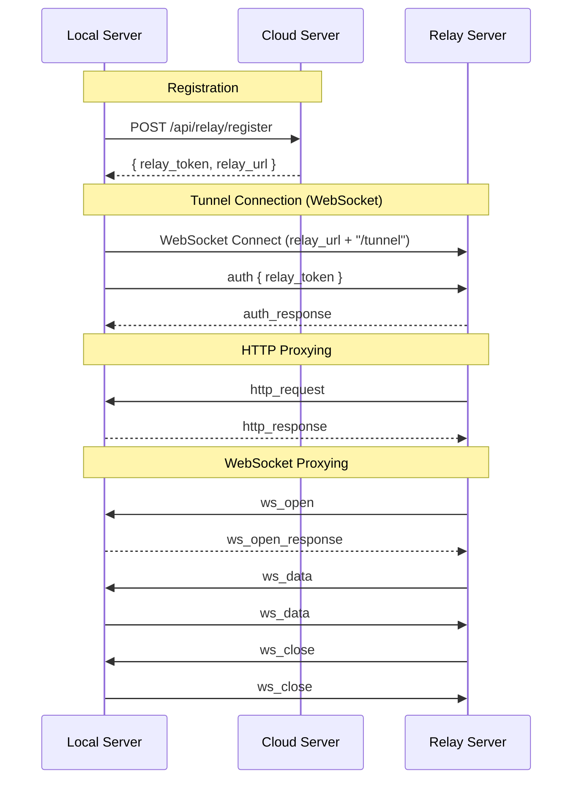

# Tunnel Protocol Specification

Version: 1

## 概述

Pockode Tunnel 是一个轻量级协议，用于穿透 NAT 访问本地 Go Server。

```
手机 ──HTTP/WS──> Relay Server ──Tunnel Protocol──> Local Server
```

## 设计原则

1. **极简** — 简单到没有修改的理由
2. **透明转发** — 原样传递 HTTP/WS，不做解析
3. **与本体一致** — 遵循 Pockode 本体的 WebSocket 消息格式

## 连接流程



## 消息格式

所有消息均为 JSON。扁平结构，公共字段仅 `version` 和 `type`。

`request_id` 用于标识请求/连接：
- HTTP: Relay Server 在发送 `http_request` 时生成，Local Server 在 `http_response` 中原样返回
- WebSocket: Relay Server 在发送 `ws_open` 时生成，后续 `ws_data`、`ws_close` 使用相同 `request_id`

```typescript
interface BaseMessage {
  version: number  // 协议版本 (1)
  type: string     // 消息类型
}
```

## 消息类型

### auth (Local Server → Relay Server)

隧道认证请求。WebSocket 连接后的第一条消息。

```json
{
  "version": 1,
  "type": "auth",
  "relay_token": "token-from-registration",
  "client_version": "0.5.0"
}
```

- `relay_token`: 从 `/api/relay/register` 获取的令牌
- `client_version`: 客户端版本号

### auth_response (Relay Server → Local Server)

认证结果。

成功：
```json
{
  "version": 1,
  "type": "auth_response",
  "success": true
}
```

失败：
```json
{
  "version": 1,
  "type": "auth_response",
  "success": false,
  "error": "invalid relay token"
}
```

- `success`: 认证是否成功
- `error`: 失败时的错误信息（可选）

### http_request (Relay Server → Local Server)

转发 HTTP 请求。

```json
{
  "version": 1,
  "type": "http_request",
  "request_id": "550e8400-e29b-41d4-a716-446655440000",
  "method": "GET",
  "path": "/api/sessions",
  "headers": {
    "Authorization": "Bearer xxx",
    "Content-Type": "application/json"
  },
  "body": ""
}
```

- `request_id`: 请求标识符（UUID），由 Relay Server 生成
- `method`: HTTP 方法（GET, POST, PUT, DELETE 等）
- `path`: 请求路径（含 query string）
- `headers`: HTTP 请求头
- `body`: Base64 编码，空时为 `""`

### http_response (Local Server → Relay Server)

返回 HTTP 响应。

```json
{
  "version": 1,
  "type": "http_response",
  "request_id": "550e8400-e29b-41d4-a716-446655440000",
  "status": 200,
  "headers": {
    "Content-Type": "application/json"
  },
  "body": "eyJzZXNzaW9ucyI6IFtdfQ=="
}
```

- `request_id`: 与对应的 `http_request` 相同
- `status`: HTTP 状态码
- `headers`: HTTP 响应头
- `body`: Base64 编码

### ws_open (Relay Server → Local Server)

WebSocket 连接请求。

```json
{
  "version": 1,
  "type": "ws_open",
  "request_id": "ws-conn-id",
  "path": "/ws",
  "headers": {
    "Authorization": "Bearer xxx"
  }
}
```

- `request_id`: 此 WebSocket 连接的标识符，由 Relay Server 生成
- `path`: 请求路径（含 query string）
- `headers`: HTTP Upgrade 请求头

### ws_open_response (Local Server → Relay Server)

WebSocket 连接结果。

成功：
```json
{
  "version": 1,
  "type": "ws_open_response",
  "request_id": "ws-conn-id",
  "status": 101
}
```

失败：
```json
{
  "version": 1,
  "type": "ws_open_response",
  "request_id": "ws-conn-id",
  "status": 401,
  "headers": {
    "Content-Type": "application/json"
  },
  "body": "eyJlcnJvciI6ICJpbnZhbGlkIHRva2VuIn0="
}
```

- `request_id`: 与对应的 `ws_open` 相同
- `status`: HTTP 状态码（101 表示成功升级）
- `headers`: 失败时的响应头（可选）
- `body`: 失败时的响应体，Base64 编码（可选）

### ws_data (双向)

WebSocket 数据帧。

```json
{
  "version": 1,
  "type": "ws_data",
  "request_id": "ws-conn-id",
  "binary": false,
  "data": "eyJ0eXBlIjogImF1dGgiLCAidG9rZW4iOiAieHh4In0="
}
```

- `request_id`: 与对应的 `ws_open` 相同
- `binary`: true 表示二进制帧，false 表示文本帧
- `data`: Base64 编码

### ws_close (双向)

WebSocket 连接关闭。

```json
{
  "version": 1,
  "type": "ws_close",
  "request_id": "ws-conn-id",
  "code": 1000,
  "reason": "normal closure"
}
```

- `request_id`: 与对应的 `ws_open` 相同
- `code`: WebSocket 关闭状态码（可选）
- `reason`: 关闭原因（可选）

### ping / pong (双向)

保持连接。

```json
{ "version": 1, "type": "ping" }
```

```json
{ "version": 1, "type": "pong" }
```

- 30 秒无消息则发送 `ping`
- 收到 `ping` 立即回复 `pong`
- 60 秒无 `pong` 视为连接断开

### error (双向)

错误通知。用于通知对方某个请求处理失败。

- Relay Server → Local Server: 例如，用户取消请求
- Local Server → Relay Server: 例如，请求处理超时、内部错误

```json
{
  "version": 1,
  "type": "error",
  "request_id": "optional-request-id",
  "code": "timeout",
  "message": "request timed out"
}
```

- `request_id`: 如有关联请求则指定（可选）
- `code`: 错误码
  - `timeout` — 请求超时
  - `not_found` — 目标未找到
  - `internal` — 内部错误
- `message`: 错误详情

## 重连

连接断开时的重连规则：

1. 指数退避: 1s, 2s, 4s, 8s, 16s, 30s (max)
2. 重连时从 `auth` 开始
3. `relay_token` 有效则保持相同 `relay_url`

## 版本控制

- `version: 1` 永久支持
- 新功能以 `version: 2` 另行定义
- Relay Server 同时支持多版本
- Client 使用自身支持的最新版本连接

## 安全考虑

- Tunnel 连接始终使用 WSS (TLS)
- 通过 `relay_token` 进行 WebSocket 认证（仅知道 `relay_url` 无法连接）
- `AUTH_TOKEN`（Go Server 认证令牌）不会离开客户端
- 各请求的认证在应用层（Go Server）进行
